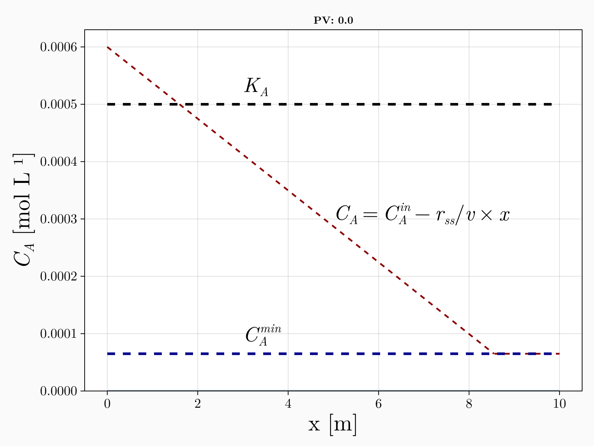

# The electron-yielding capacity of the matrix can explain apparent zero-order reduction of electron-acceptors in aquifers at steady state

This repository contain the numerical model used to confirm the theorectical derivations in the submitted paper that contains a mechanistic explanation to why the reduction of electron acceptors in natural settings often follow a zero-order rate in various settings. Please see the paper (to be submited, details soon) for the general explanations.



This code base is using the [Julia Language](https://julialang.org/) and
[DrWatson](https://juliadynamics.github.io/DrWatson.jl/stable/)
to make a reproducible scientific project named
> redox_steady_state_aquifers

It is authored by Vitor Cantarella, Adrian Mellage & Olaf Cirpka.

To (locally) reproduce this project, do the following:

0. Download this code base. Notice that raw data are typically not included in the
   git-history and may need to be downloaded independently.
1. Open a Julia console and do:
   ```
   julia> using Pkg
   julia> Pkg.add("DrWatson") # install globally, for using `quickactivate`
   julia> Pkg.activate("path/to/this/project")
   julia> Pkg.instantiate()
   ```

This will install all necessary packages for you to be able to run the scripts and
everything should work out of the box, including correctly finding local paths.

You may notice that most scripts start with the commands:
```julia
using DrWatson
@quickactivate "redox_steady_state_aquifers"
```
which auto-activate the project and enable local path handling from DrWatson.
